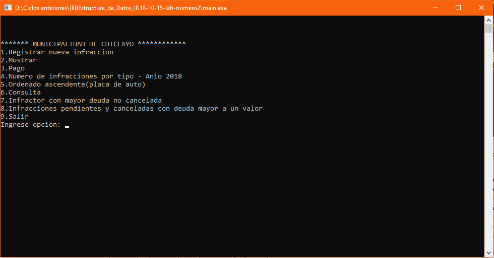

# Control de infracciones de transito
Sistema de control de infracciones de transito que permite registrar infracciones, mostrarla, pagar, mostrar la cantidad de infracciones por tipo en el año 2018, ordenar las infracciones ascendentemente según su placa, consultar el promedio de deudas de un infractor según su nombre, mostrar el infractor con la mayor deuda, mostrar la cantidad de infracciones pendientes y canceladas con una deuda mayor a cierto monto, **15/10/18**.

<strong>Imagen:</strong> Menú principal.

